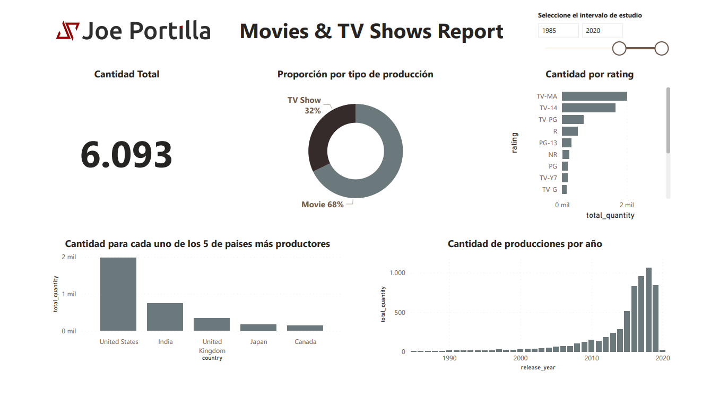

# Movies & TV Shows Report - Power BI
Dashboard en PowerBI sobre películas y series alojados en Netflix. Gráficas por rating, país, año y tipo de producción

## Dataset
Este conjunto de datos consta de programas de televisión y películas disponibles en Netflix a partir de 2019. Actualizado hasta el 20 de enero de 2020.

## Instructor
Joseph Santiago Portilla - Ingeniero Electrónico.
- GitHub: https://github.com/JoePortilla
- Twitter: https://twitter.com/JoePortilla
- LinkedIn: https://www.linkedin.com/in/PortillaJoe
- Kaggle: https://www.kaggle.com/joeportilla